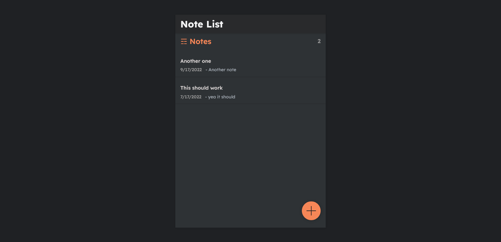

# Notes app solution

This is a fllow along project from [Dennis Ivy YouTube channel](https://www.youtube.com/watch?v=tYKRAXIio28&t=11300s&ab_channel=DennisIvy).

## Table of contents

- [Overview](#overview)
  - [The challenge](#the-challenge)
  - [Screenshot](#screenshot)
  - [Links](#links)
- [My process](#my-process)
  - [Built with](#built-with)
  - [What I learned](#what-i-learned)
  - [Useful resources](#useful-resources)
- [Author](#author)
- [Acknowledgments](#acknowledgments)

## Overview

### The challenge

The notes app provides the following functionality:

- Create a note
- Update a note
- View a note
- Delete a note

### Screenshot

### Links

- Solution URL: [GitHub](https://github.com/Momzit/DjangoReact-Notes-App)
- Live Site URL: [Notes app](https://react-django-noteslist.herokuapp.com/#/)

## My process

### Built with

- Django
- Django REST Framework
- Flexbox
- CSS Grid
- [React](https://reactjs.org/) - JS library

### What I learned

I learned how to connect an API with a frontend UI. Defining different end points to which a cient can be directed to. Django provides an easy to implement API using the Django rest framework. I also learned the different verbs that are used with APIs such as GET, PUT, POST, and DELETE.

### Useful resources

- [Dennis Ivy video](https://www.youtube.com/watch?v=tYKRAXIio28&t=11300s&ab_channel=DennisIvy) - This is the video I followed in creating the notes app.

## Author

- Website - [Moment](https://react-django-noteslist.herokuapp.com/#/)
- GitHub - [@Momzit](https://github.com/Momzit)

## Acknowledgments

Thanks to Dennis for the amazing video that is easy to follow and highly educational.
